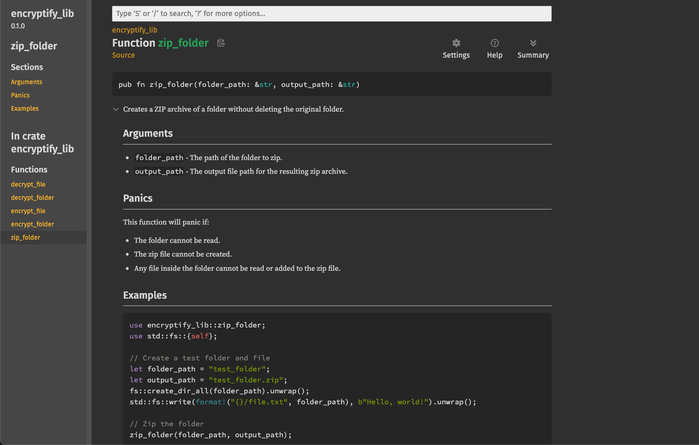

# Encryptify

[](https://github.com/WebDevCaptain/encryptify/actions/workflows/ci.yml)

**Encryptify** is a command-line tool for encrypting and decrypting files and folders. It ensures the confidentiality of your data by using `AES encryption`.

> For folders, it compresses them into a ZIP archive before encrypting.

---

## Features

1. **File Encryption/Decryption**: Securely encrypt and decrypt individual files.

2. **Folder Encryption/Decryption**: Compress folders into ZIP archives before encrypting them.

3. **AES Encryption**: Supports AES-128 for strong security. [TODO: Support for AES-256]

## Usage (In development)

- Encrypt

  ```bash
  cargo run -p encryptify-cli -- --mode encrypt --path ./sample-file.txt --key hellothere123456hellothere123456
  ```

- Decrypt

  ```bash
  cargo run -p encryptify-cli -- --mode decrypt --path ./sample-file.txt.enc --key hellothere123456hellothere123456
  ```

- Documentation
  ```bash
  cargo doc --open
  ```


